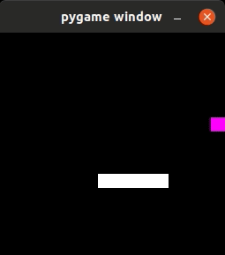
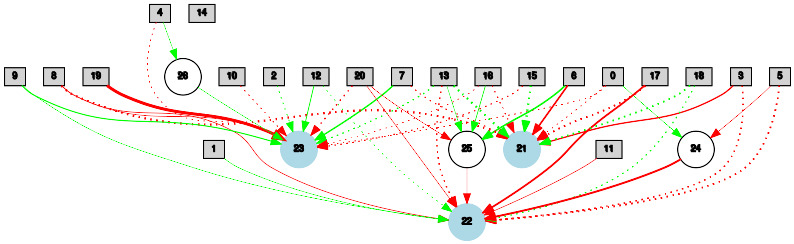

# neat-snake
Integrating Neural Evolution In Augmented Topologies in a snake game to make it a self learner.



It also print topologies



# Requirements
This projects requires pygame python library as well as python-neat library
For running trained models (and print network topologies), you will also need graphviz and matplotlib

# Running
To run this game you need to execute the game file inside the project folder with python.  

```bash
python game.py
```

## Saving knowledge
Whenever you quit the game a new file called "population.dat" gets created. That file contains all the knowledge learnt so far.

## Loading knowledge
In order to load knowledge , open up the game with the population file as a terminal argument.
```bash
python game.py population.dat
```

# Notes
The game is still under development. The snake is still not able to always go to the food, but it can find 50+ foods.
